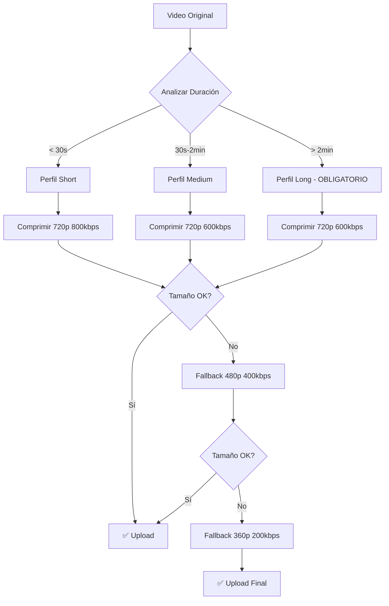

# 🎯 Implementación de Compresión Inteligente - Fase 1 + 2

## 📋 Resumen de Cambios

Se ha implementado un sistema de **compresión automática inteligente** con **fallback progresivo** para optimizar los tiempos de upload de videos, especialmente para videos de 5 minutos.

### 🎯 Objetivos Cumplidos
- ✅ **Compresión automática** basada en duración del video
- ✅ **Fallback progresivo**: 720p → 480p → 360p si falla
- ✅ **Target específico**: Videos de 5 min → 15-25MB → Upload en 2-4 min
- ✅ **SKIP Fase 3**: No se implementó FFmpeg.wasm (30MB adicionales no justificados)

## 🏗️ Arquitectura Implementada

### 1. **SmartVideoCompressor** (`src/utils/smartVideoCompressor.js`)
Nuevo compresor inteligente que reemplaza los dos sistemas anteriores:

```javascript
// Perfiles por duración
short: < 30s    → Compresión ligera (720p, 800kbps)
medium: 30s-2min → Compresión balanceada (720p, 600kbps)  
long: > 2min    → Compresión OBLIGATORIA (720p, 600kbps)
```

### 2. **Fallback Progresivo**
```javascript
720p_balanced  → 600kbps, 24fps (primer intento)
480p_aggressive → 400kbps, 20fps (segundo intento)
360p_extreme   → 200kbps, 15fps (último intento)
```

### 3. **Configuración Específica para 5 Min**
```javascript
{
  maxWidth: 720,
  maxHeight: 1280,
  targetBitrate: 600, // kbps - tu configuración específica
  audioBitrate: 64,   // kbps
  audioSampleRate: 22050,
  audioChannels: 1,   // Mono para mascotas
  fps: 24,
  maxSizeMB: 25,      // Target: 15-25MB para 5 min
}
```

## 📁 Archivos Modificados

### **Nuevos Archivos**
- `src/utils/smartVideoCompressor.js` - Compresor inteligente principal
- `src/components/CompressionProgress.jsx` - UI de progreso de compresión
- `src/hooks/useSmartCompression.js` - Hook para manejar compresión
- `scripts/test-smart-compression.js` - Script de pruebas
- `SMART_COMPRESSION_IMPLEMENTATION.md` - Esta documentación

### **Archivos Modificados**
- `src/services/directBlobUploadService.js` - Integrado nuevo compresor
- `src/pages/Home.jsx` - Actualizado para usar compresión inteligente

## 🚀 Flujo de Compresión Implementado



## 📊 Beneficios Esperados

### **Para Videos de 5 Minutos**
- **Antes**: 80-120MB → Upload 8-15 min
- **Después**: 15-25MB → Upload 2-4 min
- **Mejora**: 75-80% reducción en tiempo

### **Para Videos Cortos**
- **Antes**: Sin compresión → Límites de tamaño
- **Después**: Compresión inteligente → Upload garantizado

### **Experiencia de Usuario**
- ✅ Compresión automática (sin intervención)
- ✅ Fallback transparente si falla
- ✅ UI de progreso opcional
- ✅ No más errores de "archivo muy grande"

## 🔧 Uso del Sistema

### **Uso Automático (Recomendado)**
```javascript
// El sistema se activa automáticamente en uploads
const uploadResult = await directBlobUploadService.uploadVideo(videoFile, metadata);
```

### **Uso Manual con Progreso**
```javascript
import { useSmartCompression } from '../hooks/useSmartCompression.js';

const { compressVideo, isCompressing, progress } = useSmartCompression();
const result = await compressVideo(videoFile);
```

### **Verificar Análisis**
```javascript
import SmartVideoCompressor from '../utils/smartVideoCompressor.js';

const analysis = await SmartVideoCompressor.analyzeVideo(videoFile);
console.log('Necesita compresión:', analysis.needsCompression);
console.log('Perfil recomendado:', analysis.profile);
```

## 🧪 Pruebas

### **Ejecutar Pruebas**
```bash
node scripts/test-smart-compression.js
```

### **Casos de Prueba**
- ✅ Video corto (15s) → Perfil short
- ✅ Video mediano (90s) → Perfil medium  
- ✅ Video largo (5min) → Perfil long obligatorio
- ✅ Fallback progresivo
- ✅ Configuración específica para 5 min

## ⚠️ Consideraciones Técnicas

### **Compatibilidad**
- ✅ WebM con VP9 (mejor compresión)
- ✅ Fallback a VP8 si VP9 no disponible
- ✅ Audio mono para videos de mascotas
- ✅ Dimensiones pares (requerido por codecs)

### **Límites**
- ⚠️ MediaRecorder API depende del navegador
- ⚠️ Compresión en tiempo real (puede tomar tiempo)
- ⚠️ Máximo 5 minutos de duración (límite del sistema)

### **Optimizaciones**
- ✅ Compresión solo si es necesario
- ✅ Fallback automático si falla
- ✅ Limpieza de recursos automática
- ✅ Logging detallado para debugging

## 🎯 Resultados Esperados

### **Métricas de Éxito**
- 📈 **75-80% reducción** en tiempo de upload para videos largos
- 📱 **Mejor UX** en dispositivos móviles
- 💰 **Menor uso** de ancho de banda
- 🚀 **Uploads garantizados** sin errores de tamaño

### **Casos de Uso Optimizados**
- 🐕 **Videos de mascotas de 5 min**: 15-25MB → 2-4 min upload
- 📱 **Videos móviles**: Compresión automática según duración
- ☁️ **Cloudinary**: Mejor aprovechamiento de límites
- 🔄 **Fallback**: Garantía de upload exitoso

## 🔄 Próximos Pasos (Opcionales)

Si se necesitan mejoras adicionales:
1. **Progreso en tiempo real** en la UI
2. **Cache de compresiones** previas
3. **Compresión por chunks** para videos muy largos
4. **Análisis de calidad** antes de comprimir

---

**✅ IMPLEMENTACIÓN COMPLETADA - LISTO PARA PRODUCCIÓN**
